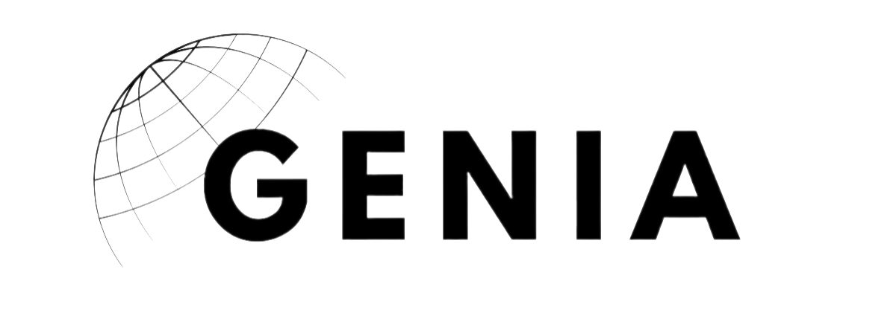

# GenIA
****
This is a simple web application that allows users to chat and generate Code, Music, Video, and Image.

### Features
- Chat
- Code IA (Code Generation) Using Ollama 
- Music IA (Music Generation) Using Replicate AI Models
- Video IA (Video Generation) Using Replicate AI Models
- Image IA (Image Generation) Using OpenAI DALL-E API

### Tech Stack
- Next.js
- Tailwind CSS
- Node.js
- OpenAI API
- Ollama API (codellama for code generation & llama2 for chat)
- Replicate AI API

You need to install and run Ollama locally to use the Code IA feature. You can find the Ollama repository [Ollama](https://ollama.com/) 

### Installation & prerequisites
```
    git clone 
```
```
     npm install
```
Setup your environment variables in a .env file
```
    OLLAMA_ENV="http://127.0.0.1:11434"

    OPENAI_API_KEY=

    REPLICATE_API_TOKEN=
```

### Run the application
```
    npm run dev
```


